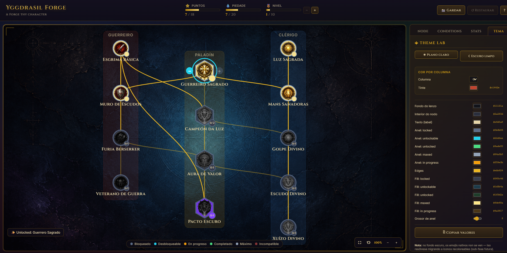

# Yggdrasil Forge

> Open-source TypeScript monorepo for building interactive skill
> trees — engine, storage, React renderer, plugins, search, and
> validators.

[](LICENSE)

---

## ⚠️ Status: Alpha (0.1.0)

This is an **alpha release**. Public APIs may change before 1.0.0.
Use for evaluation, prototyping, and feedback. **Pin exact versions
in production environments.**

> 🗺️ **Roadmap a 1.0:** ver
> [`docs/architecture/ROADMAP-1.0-RENDERER-TO-STUDIO.md`](docs/architecture/ROADMAP-1.0-RENDERER-TO-STUDIO.md).


## What is Yggdrasil Forge?

A modular TypeScript engine for designing, rendering, and
interacting with skill trees — the kind of branching progression
systems found in RPGs, learning platforms, gamified curricula,
and competency frameworks.

**Highlights**:

- 🌳 **Composable trees**: nodes, edges, prerequisites, costs,
  resources, stats — all typed strictly.
- ⚡ **Reactive state**: efficient diffing via `StateStore` +
  `ChangeTracker`; subscribers fire only on relevant changes.
- 💾 **Persistence**: 6 storage adapters (Memory, LocalStorage,
  SessionStorage, IndexedDB, FileSystem, ScopedStorage).
- 📸 **Snapshots + loadouts**: save / restore / share builds via
  serialized URLs.
- ⚛️ **React renderer**: drop-in `<SkillTree>` component with
  themes + hooks.
- 🔌 **Plugin system**: 8 lifecycle hooks; official `HistoryPlugin`,
  `DebugPlugin`, `SearchPlugin`.
- 🔍 **Search**: custom substring engine with field-weighted
  scoring + `LocalizedString` support.
- ✅ **Validators**: 9 built-in structural + pedagogical rules
  (cycles, reachability, branching balance, etc.).
- 🌐 **i18n-first**: every error message localized in gl / es / en.

## See it in action

The [`react-demo`](./examples/react-demo) example builds **"The Paladin"** — a
13-node skill tree with three branches, complex prerequisites, mutually-exclusive
paths, dynamic theming, and custom painted badges:



**New here? Start with the walkthrough.** It builds this exact tree step by step —
data model → rendering → theming → art — explaining the *why* at each step and the
pitfalls to avoid along the way:

- 📖 **[Walkthrough — build the Paladin (English)](docs/guide/paladin-walkthrough.en.md)**
- 📖 **[Tutorial — construye El Paladín (Español)](docs/guide/paladin-walkthrough.es.md)**

## Why Yggdrasil Forge?

If you're building a skill tree, progression system, or branching
curriculum, you have two options:

1. **Roll your own**: implement nodes, edges, prerequisites, state
   management, persistence, validation... and discover edge cases
   you didn't anticipate.
2. **Use Yggdrasil Forge**: a tested, modular engine that has
   already solved the hard problems.

### What you'd build anyway

If your project needs more than a few static nodes, you'll
eventually need:

- **Prerequisite logic**: not just `A → B`, but `(A AND B) OR C`,
  resource-gated unlocks, mutual exclusions. Yggdrasil Forge ships
  `UnlockRule` — a discriminated union for composable rules.
- **State management**: efficient diffing so React only re-renders
  what changed. We use `StateStore` + `ChangeTracker` (2195 tests
  worth of edge cases handled).
- **Persistence + migrations**: 6 storage backends, snapshot
  system, share-via-URL — plus a migration framework so stored
  data survives schema changes.
- **Validators**: detect cycles, unreachable nodes, redundant
  prerequisites *before* shipping to users. 9 built-in rules cover
  structural and pedagogical concerns.
- **i18n**: every error message is localized (gl/es/en); every
  user-facing label is a `LocalizedString`.

### What you probably *wouldn't* build

These come "free" with Yggdrasil Forge:

- **Plugin system** with 8 lifecycle hooks for cross-cutting
  concerns (analytics, debugging, history tracking, custom
  validators).
- **Custom search** with field-weighted scoring (label > keywords >
  description > tags).
- **React renderer** with built-in SVG components, reactive hooks,
  and a default theme.
- **Read-only mode** for shareable preview links.
- **Headless mode** if you want full control over styling.

### When *not* to use Yggdrasil Forge

Be honest: if you need **≤5 nodes** and **no state persistence**,
just use a handful of hard-coded `if` statements. Yggdrasil Forge
earns its dependency footprint when:

- You have **10+ nodes** with branching prerequisites.
- State persistence matters (browser refresh, multi-device sync,
  shareable builds).
- Multiple developers will work on the system over time.
- You want to evolve the tree without rewrites (migrations + schema
  versioning).

## Quick start

### Installation

```bash
pnpm add @yggdrasil-forge/core @yggdrasil-forge/common @yggdrasil-forge/storage
```

For React:

```bash
pnpm add @yggdrasil-forge/react react
```

### Minimal example

```typescript
import { TreeEngine } from '@yggdrasil-forge/core'
import { MemoryStorage } from '@yggdrasil-forge/storage'
import { SCHEMA_VERSION } from '@yggdrasil-forge/common'

const treeDef = {
  id: 'my-tree',
  schemaVersion: SCHEMA_VERSION,
  version: '1.0.0',
  label: { en: 'My skill tree' },
  nodes: [
    { id: 'a', type: 'small' as const, label: { en: 'Skill A' } },
    {
      id: 'b',
      type: 'small' as const,
      label: { en: 'Skill B' },
      prerequisites: { type: 'node_unlocked' as const, nodeId: 'a' },
    },
  ],
  edges: [
    { id: 'e1', source: 'a', target: 'b', type: 'dependency' as const },
  ],
}

const engine = new TreeEngine(treeDef, { storage: new MemoryStorage() })

const result = await engine.unlock('a')
if (result.ok) {
  console.log('Unlocked!')
}
```

See [`examples/node-basics`](./examples/node-basics) for the
complete annotated walkthrough.

## Packages

This is a monorepo. The following packages are published to npm:

### Active

| Package | Description |
|---------|-------------|
| [`@yggdrasil-forge/common`](packages/common) | Shared types, errors, `Result<T>`, `LocalizedString`, `StorageAdapter` interface. |
| [`@yggdrasil-forge/core`](packages/core) | `TreeEngine`, state management, layouts, federation. |
| [`@yggdrasil-forge/storage`](packages/storage) | 6 storage adapter implementations. |
| [`@yggdrasil-forge/react`](packages/react) | React renderer + hooks + themes. |
| [`@yggdrasil-forge/plugins`](packages/plugins) | Official plugins: History, Debug. |
| [`@yggdrasil-forge/search`](packages/search) | Search engine + SearchPlugin. |
| [`@yggdrasil-forge/validators`](packages/validators) | 9 built-in pedagogical rules. |

### Scaffold (reserved for future phases)

`@yggdrasil-forge/{analytics, cli, devtools, diff, exporters,
heatmap, i18n, importers, multitenancy, neo4j, stats, themes,
webhooks}` — see each package's README for planned scope.

## Documentation

- **[Paladin walkthrough](docs/guide/paladin-walkthrough.en.md)**
  ([Español](docs/guide/paladin-walkthrough.es.md)) — build a real skill
  tree step by step, with diagrams and gotchas. Best starting point.
- **[Architecture MASTER document](docs/architecture/MASTER.md)** —
  full design rationale + roadmap.
- **[Development briefings](docs/briefings/)** — complete
  per-sub-phase history (~85 briefings).
- **Per-package READMEs** — installation + API summary for each
  package.

## Development

Requires **Node.js ≥ 22** and **pnpm 11**.

```bash
git clone https://github.com/cancioneschorriscortas-max/yggdrasil-forge
cd yggdrasil-forge
pnpm install
pnpm typecheck   # 24/24
pnpm test        # 2195 tests
pnpm build       # all packages
```

Run the example:

```bash
pnpm --filter @yggdrasil-forge-examples/node-basics start
```

## Roadmap

The project follows a phased development plan documented in
[MASTER.md](docs/architecture/MASTER.md). Phases 0–8 are complete
(58+ sub-phases without rollback). Phase 9 (Visual Editor + Wizards
+ Templates) is next.

## Contributing

The project is in active alpha development. Issues and feedback
welcome via GitHub. PR contributions accepted after 0.1.0 is
stable.

## License

[MIT](LICENSE)

---

*Yggdrasil Forge is named after the world tree of Norse mythology,
the cosmic ash whose branches connect the nine realms — a fitting
metaphor for a system that connects nodes across domains.*
