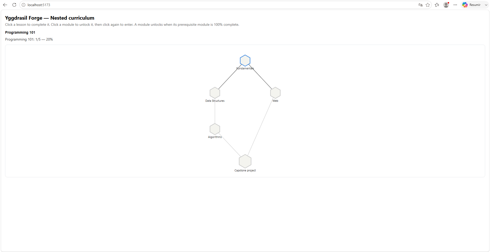
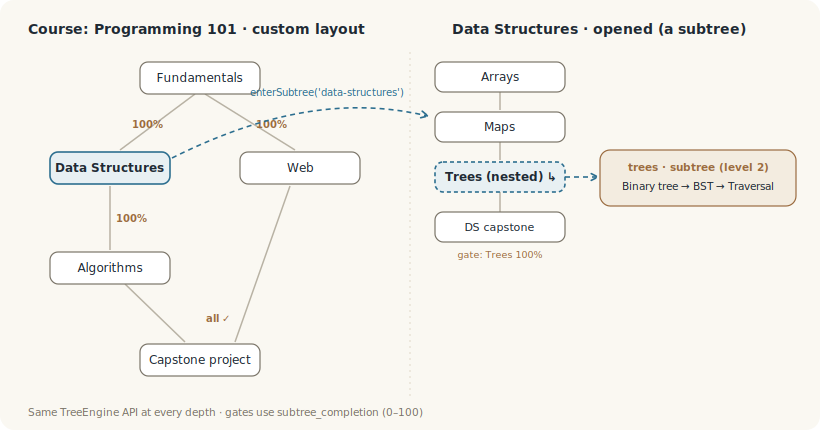

# Tutorial del curriculum — composición con subárboles anidados

> **Destacados**
> - Un curso modelado como **subárboles anidados** — totalmente dirigido por datos.
> - Las puertas de los módulos usan **`subtree_completion`** (un porcentaje de un subárbol).
> - **Dos niveles de anidamiento**: un subárbol dentro de un subárbol.
> - **UI deliberadamente sencilla** — este ejemplo vende *composición*, no decoración. Para el hermano pulido, ver el [tutorial de Learn Yggdrasil Forge](./learn-yggdrasil-walkthrough.es.md).


<!-- captura: poner aquí una captura del ejemplo curriculum en marcha -->

## Qué muestra este ejemplo

`examples/curriculum` es **Programming 101**: un curso cuyos módulos son árboles de habilidades independientes, compuestos bajo un único padre. Muestra cómo Yggdrasil Forge expresa un currículo (o un árbol tecnológico, o cualquier progresión por capas) como datos puros — sin código de motor a medida.

## La forma: un curso como subárboles anidados

El árbol padre (`programming-101`, layout `custom`) tiene cinco nodos: cuatro **anclas de módulo** y un capstone. Cada ancla apunta a su propio `TreeDef` mediante `subtreeId`, y esos defs viven en el registro `subtrees` del padre. Uno de ellos — Data Structures — anida otro subárbol (`trees`), dando **dos niveles** de composición.



Un `subtree_anchor` es solo un nodo que lleva un `subtreeId`; el subárbol al que apunta es un `TreeDef` completo, así que puede tener sus propios subárboles, de forma recursiva. Nada de esto es un caso especial — es el mismo modelo de datos a cualquier profundidad.

## Puertas: `subtree_completion`

Los módulos se desbloquean según lo completo que esté un subárbol prerrequisito. `subtree_completion` es un porcentaje (0–100): nodos desbloqueados ÷ total × 100. Programming 101 conecta tres formas de dependencia:

- **Cadena** — Fundamentals → Data Structures → Algorithms (cada uno necesita el anterior al 100%).
- **Paralelo** — Fundamentals también desbloquea Web.
- **Convergencia** — el Capstone necesita **todos** (Algorithms y Web al 100%) — una regla `all`.

Los prerrequisitos controlan el *desbloqueo*; no son invariantes continuos, así que bajar el progreso más tarde no vuelve a bloquear lo ya desbloqueado.

## Drill-in

Abrir un módulo entra en su subárbol: `engine.enterSubtree(subtreeId)` devuelve un **`TreeEngine` hijo**, que se renderiza con el mismo componente `<SkillTree>`. El ejemplo mantiene una pila de motores más una miga de pan para subir. Esta es la forma *mínima* del drill-in; el ejemplo Learn Yggdrasil Forge construye una cáscara más rica — progreso, "por qué bloqueado", un botón Abrir explícito — sobre las mismas llamadas.

## Sencillo a propósito

Los nodos aquí son sobrios: sin insignias, niveles ni iconos. Ese es el objetivo — el ejemplo aísla **composición y puertas** para que se lean con facilidad. El estilo y la decoración son una preocupación aparte (un tema más UI de consumidor), mostrada en el hermano pulido.

## Ejecutarlo

```bash
pnpm install
pnpm --filter @yggdrasil-forge-examples/curriculum dev
```

## Resumen

Un currículo multinivel es solo *datos*: anclas más `subtreeId` más un registro `subtrees` recursivo, con puertas `subtree_completion`. El motor trata cada profundidad de forma idéntica, y un `<SkillTree>` simple renderiza cada nivel — sin cambios en el renderizador.
