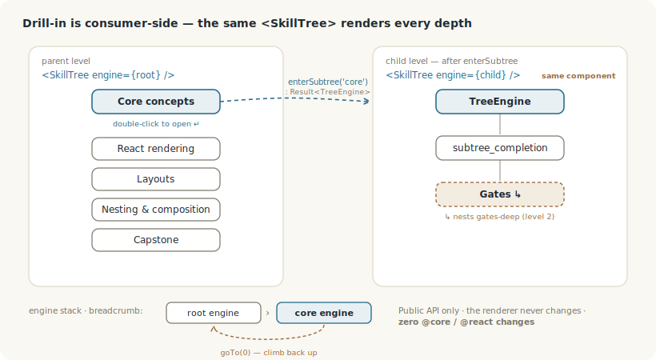
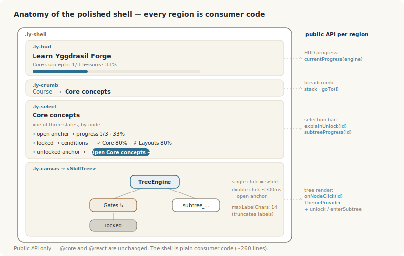

# Tutorial de Learn Yggdrasil Forge — guía práctica

> Construye una progresión multinivel funcional desde cero y luego mira cómo el ejemplo `learn-yggdrasil` la escala a un curso completo. **Cada fragmento de código de abajo es real** — compila y funciona contra la API pública.
> Para el hermano mínimo que aísla la composición, ver el [tutorial del Curriculum](./curriculum-walkthrough.es.md).


<!-- captura: poner aquí una captura del ejemplo learn-yggdrasil en marcha -->

## El modelo mental (léelo primero)

```
TreeDef       el mundo que declaras         nodos · prerrequisitos · layout
   │  describe
   ▼
TreeEngine    el estado vivo + las reglas    unlock · puertas · explicaciones
   │  evalúa
   ▼
Snapshot      una vista plana y serializable  qué está desbloqueado ahora
   │  renderiza
   ▼
SkillTree     una vista del motor             React hoy · editor en la hoja de ruta
```

`TreeDef` **describe** el mundo; `TreeEngine` **contiene el estado vivo** y las reglas que lo cambian. Esa separación es lo esencial. El motor no solo lleva el progreso — puede *explicar sus propias reglas*: `engine.explainUnlock(id)` te dice, condición a condición, por qué un nodo sigue bloqueado. **Esto es un motor de progresión, y el renderizador es solo una vista de él.**

## 1. Instalación

```bash
pnpm add @yggdrasil-forge/core @yggdrasil-forge/react @yggdrasil-forge/common
```

`core` es el motor (agnóstico de framework), `react` es el renderizador, `common` lleva los tipos compartidos y `SCHEMA_VERSION`.

## 2. Un nodo, y cómo se desbloquea

Un nodo es cualquier paso de cualquier progresión — no solo una habilidad de RPG. Cocinar sirve igual:

```ts
import type { NodeDef } from '@yggdrasil-forge/core'

const boil: NodeDef = { id: 'boil', type: 'small', label: { en: 'Boil water' } }
```

Un nodo permanece bloqueado hasta que se cumplen sus `prerequisites`. Tres formas cubren casi todo:

```ts
// se desbloquea cuando otro nodo está desbloqueado
prerequisites: { type: 'node_unlocked', nodeId: 'boil' }

// se desbloquea cuando un subárbol está ≥ N% completo (0–100)
prerequisites: { type: 'subtree_completion', subtreeId: 'core', percent: 80 }

// se desbloquea cuando se cumplen TODAS estas condiciones
prerequisites: { type: 'all', conditions: [
  { type: 'node_unlocked', nodeId: 'pasta' },
  { type: 'node_unlocked', nodeId: 'eggs'  },
]}
```

Los prerrequisitos controlan solo el *desbloqueo* — no son continuos, así que bajar el progreso más tarde no vuelve a bloquear un nodo ya abierto.

## 3. Montar un TreeDef

Un `TreeDef` es el conjunto: metadatos, un `layout`, `nodes` y `edges` (las líneas que se dibujan entre nodos). Dos pequeños helpers quitan el ruido — cópialos:

```ts
import { SCHEMA_VERSION } from '@yggdrasil-forge/common'
import type { EdgeDef, NodeDef, TreeDef } from '@yggdrasil-forge/core'

const step = (id: string, label: string, needs?: string): NodeDef =>
  needs === undefined
    ? { id, type: 'small', label: { en: label } }
    : { id, type: 'small', label: { en: label }, prerequisites: { type: 'node_unlocked', nodeId: needs } }

const edge = (source: string, target: string): EdgeDef =>
  ({ id: `${source}__${target}`, source, target, type: 'dependency' })
```

Un árbol completo y válido — hacer carbonara:

```ts
const cooking: TreeDef = {
  id: 'cooking',
  schemaVersion: SCHEMA_VERSION,
  version: '1.0.0',
  label: { en: 'Cooking' },
  layout: { type: 'tree', nodeSpacing: 180, levelSpacing: 150 },
  nodes: [
    step('boil', 'Boil water'),
    step('pasta', 'Cook pasta', 'boil'),       // necesita boil
    step('carbonara', 'Carbonara', 'pasta'),   // necesita pasta
  ],
  edges: [edge('boil', 'pasta'), edge('pasta', 'carbonara')],
}
```

`layout` es obligatorio (`tree`, `radial`, `custom`, …). Cambia las etiquetas y es un plan de práctica de guitarra, un curso, un checklist de onboarding — al motor le da igual lo que *signifiquen* los pasos.

## 4. Crear el motor — y verlo explicarse a sí mismo

```ts
import { TreeEngine } from '@yggdrasil-forge/core'

const engine = new TreeEngine(cooking)

engine.getNodeState('boil')?.state      // 'locked' | 'unlockable' | 'unlocked' | 'maxed'  (null si no se ha tocado)
engine.explainUnlock('carbonara')       // ¿por qué está bloqueado Carbonara? → condiciones, cada una con ✓/✗ y una razón
await engine.unlock('boil')             // devuelve un Result; canUnlock es el guardián interno
```

`explainUnlock` es la señal de que esto no es un renderizador: el motor conoce sus propias reglas y sabe narrarlas. Guárdalo — es lo que alimenta un panel de "¿qué me falta?" más adelante.

## 5. Renderizarlo

```tsx
import { SkillTree, ThemeProvider } from '@yggdrasil-forge/react'
import { useMemo, useCallback, useSyncExternalStore } from 'react'

function Tree() {
  const engine = useMemo(() => new TreeEngine(cooking), [])

  // re-renderiza este componente cada vez que cambia el estado del motor
  useSyncExternalStore(
    useCallback((cb: () => void) => engine.subscribe(cb), [engine]),
    () => engine.getSnapshot(),
    () => engine.getServerSnapshot(),
  )

  const onNodeClick = (id: string) => { void engine.unlock(id) }

  return (
    <ThemeProvider theme={academic}>
      <SkillTree engine={engine} onNodeClick={onNodeClick} />
    </ThemeProvider>
  )
}
```

Eso es un árbol funcional y clicable: pulsa *Boil water*, entonces *Cook pasta* se desbloquea, y luego *Carbonara*. `SkillTree` se renderiza desde el motor; `useSyncExternalStore` es lo que hace que un clic repinte. (`academic` es solo un objeto de tema — paso 9.)

> **Gotcha, ahora que ya funciona.** Un nodo no tocado reporta `'locked'`, **nunca** `'unlockable'` — así que si condicionas `unlock` a `'unlockable'`, el primer clic no dispara nunca (y los tests no lo cazan). El guard correcto:
>
> ```ts
> const st = engine.getNodeState(id)?.state ?? 'locked'
> if (st !== 'unlocked' && st !== 'maxed') void engine.unlock(id)
> ```

## 6. Anidamiento: anclas + subárboles

Cualquier nodo puede apuntar a *otro árbol entero*. Dale `type: 'subtree_anchor'` y un `subtreeId`, y registra el hijo bajo el `subtrees` del padre:

```ts
const parent: TreeDef = {
  /* …metadatos… */
  layout: { type: 'custom' },
  nodes: [
    { id: 'core',  type: 'subtree_anchor', label: { en: 'Core concepts' },  subtreeId: 'core',
      position: { x: 300, y: 40 } },
    { id: 'react', type: 'subtree_anchor', label: { en: 'React rendering' }, subtreeId: 'react',
      position: { x: 150, y: 200 },
      prerequisites: { type: 'subtree_completion', subtreeId: 'core', percent: 80 } },
  ],
  edges: [edge('core', 'react')],
  subtrees: { core, react: reactSub },   // cada valor es un TreeDef completo
}
```

Un subárbol es a su vez un `TreeDef`, así que puede llevar sus propios `subtrees` — el anidamiento es recursivo, sin caso especial a ninguna profundidad. (`position` hace falta porque el padre usa `layout: { type: 'custom' }`.)

## 7. Drill-in: entrar en un subárbol



`enterSubtree` devuelve el hijo como un **nuevo `TreeEngine`** que renderizas con el **mismo `<SkillTree>`**. Mantén una pila para navegar:

```tsx
type Crumb = { engine: TreeEngine; label: string }
const [stack, setStack] = useState<Crumb[]>([{ engine: rootEngine, label: 'Course' }])
const current = stack[stack.length - 1]

function open(subtreeId: string, label: string) {
  const res = current.engine.enterSubtree(subtreeId)
  if (res.ok) setStack(s => [...s, { engine: res.value, label }])
}
const goTo = (i: number) => setStack(s => s.slice(0, i + 1))   // miga de pan hacia arriba
```

Siempre renderizas `<SkillTree engine={current.engine} … />`. Ese es todo el drill-in — compones motores en el lado del consumidor, **sin cambios en `@core` ni `@react`**.

## 8. ¿Por qué está bloqueado? + la cáscara

Recuerda `explainUnlock` del paso 4 — aquí se gana el sueldo, convirtiendo un nodo bloqueado en un checklist:

```ts
const res = engine.explainUnlock(selectedId)
if (res.ok && !res.value.satisfied) {
  for (const c of res.value.conditions) {
    console.log(c.satisfied ? '✓' : '✗', c.reason)   // p. ej.  ✓ Core 80%   ✗ Layouts 80%
  }
}
```

La cáscara alrededor del árbol — HUD, miga de pan, esta lista de por-qué-bloqueado, el botón Open — es todo código de consumidor sobre la API pública:



## 9. Temas

Un tema es un objeto `Theme` llano que se pasa a `ThemeProvider`. El tema `academic` activa `maxLabelChars`, que trunca las etiquetas largas con un tooltip y deja el texto completo en el `aria-label` — la librería da el *mecanismo*, tú eliges la *política*:

```ts
import type { Theme } from '@yggdrasil-forge/react'

const academic: Theme = {
  colors: { text: '#1f2933', nodeUnlocked: '#2c6e8f', nodeMaxed: '#9a6b3f', nodeFill: '#faf8f2', /* …+ nodeLocked, nodeUnlockable, nodeStroke, edge… */ },
  sizes:  { fontSize: 14, maxLabelChars: 14 },   // trunca etiquetas de más de 14 caracteres
}
```

## 10. Ejecutar el ejemplo completo

El curso conecta todo lo anterior — cuatro subárboles de módulo, puertas al 80%, anidamiento de dos niveles, la cáscara pulida — en ~260 líneas de código de consumidor. Lee `examples/learn-yggdrasil/src/` (`tree-def-learn-yggdrasil.ts` para los datos, `App.tsx` para la cáscara), y ejecútalo:

```bash
pnpm install
pnpm --filter @yggdrasil-forge-examples/learn-yggdrasil dev
```

## Más allá de los árboles de habilidades — hacia dónde va esto

*(No implementado — una dirección de investigación, mostrada para que la forma quede clara.)*

Como un `TreeEngine` es un motor de reglas sobre un grafo, los nodos no tienen por qué ser habilidades. Una dirección futura que llamamos **Living Mind** trata la misma maquinaria como un grafo de conocimiento que *aprende* del uso:

```
Living Mind
   Conocimiento · Creencias · Metas · Recuerdos
        │
        ▼  las aristas ganan peso al observarse (Rome ↔ Architecture, 0.72)
   Activación dinámica
```

La razón de ponerlo aquí: **Yggdrasil Forge modela grafos en evolución, no solo árboles de habilidades de RPG.** Un árbol de habilidades es solo la primera instancia, la más legible.

## En una línea

Datos (nodos + prerrequisitos + `subtrees` recursivo) → `new TreeEngine(def)` → `<SkillTree engine>` → hazlo vivo con `useSyncExternalStore` + `unlock`. Todo lo demás — puertas, drill-in, el motor *explicándose a sí mismo*, temas — es la API pública. El renderizador es una vista; el motor es el proyecto.
