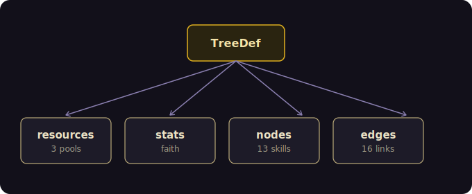
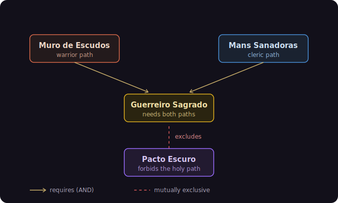

# Construyendo "El Paladín" — Anatomía de un árbol de habilidades con Yggdrasil Forge

Un recorrido paso a paso por el ejemplo `react-demo`. Enseña el motor construyendo un
árbol real: **El Paladín** — 13 nodos en 3 ramas, que exhibe 11 capacidades del motor,
un sistema de nivel, caminos mutuamente excluyentes, regiones tematizables e insignias
("badges") pintadas en AAA sobre un lienzo con textura.

Cada paso explica **por qué va donde va**, y marca **⚠️ trampas** — las reales que nos
encontramos al construir este ejemplo, no inventadas.

**Qué obtienes:**

- ✅ Árboles de habilidades data-driven — describes el árbol, el motor lo ejecuta
- ✅ Prerequisitos ricos — AND / OR, tiers, stats, recursos, conteos por scope
- ✅ Ramas mutuamente excluyentes
- ✅ Insignias pintadas personalizadas (raster) sobre un lienzo tematizado
- ✅ Tematización dinámica y tintes por región
- ✅ Snapshots — guardar y restaurar progreso

> **Principio rector: el motor es *data-driven*.** Tú describes *qué es el árbol* (un
> `TreeDef`); el motor calcula el estado, valida los desbloqueos, y la capa de React lo
> dibuja. Así que construimos en ese orden: **primero los datos, luego el render, el
> vestido al final.**

---

## 1. Qué vamos a construir


Tres columnas:

- **Guerreiro (Guerrero)** — un camino marcial lineal.
- **Clérigo** — poderes de fe que *alimentan un stat*.
- **Paladín** — la convergencia: nodos que requieren progreso en *ambos* lados, más una
  rama prohibida (**Pacto Oscuro**) que excluye a las sagradas.

Todo ello es un único objeto (`paladinTreeDef`) entregado a un único motor
(`new TreeEngine(...)`) y un único componente (`<SkillTree>`).

---

## 2. El modelo de datos — `tree-def-paladin.ts`

Es el corazón. Si esto está bien, lo demás es cableado.

### 2.1 El esqueleto del `TreeDef`



```ts
import { SCHEMA_VERSION } from '@yggdrasil-forge/common'
import type { TreeDef } from '@yggdrasil-forge/core'

export const paladinTreeDef: TreeDef = {
  id: 'el-paladin',
  schemaVersion: SCHEMA_VERSION,          // fija siempre la versión de esquema del motor
  version: '1.0.0',                        // versión de TU árbol
  label: { gl: 'O Paladín', es: 'El Paladín', en: 'The Paladin' },  // objeto i18n
  description: { /* gl / es / en */ },
  rootNodeId: 'sword-basics',              // el nodo de entrada
  // ...stats, resources, startingBudget, layout, nodes, edges
}
```

Etiquetas y descripciones son **objetos i18n** (`{ gl, es, en }`), no cadenas planas —
el motor y el renderer resuelven el idioma activo por ti.

### 2.2 Recursos y stats — la economía

Dos conceptos distintos:

- **Recursos** son *bolsas que se gastan* (monedas). El Paladín tiene tres:

```ts
resources: [
  { id: 'piety',        initial: 7,  max: 20, icon: '💧', refundable: true },
  { id: 'skill-points', initial: 18, max: 18, icon: '⭐', refundable: true },
  { id: 'level',        initial: 1,  max: 10, icon: '🎖️' },   // no se gasta — es una puerta
],
startingBudget: { resources: { 'skill-points': 18, piety: 7, level: 1 } },
```

- **Stats** son valores *derivados* a los que los nodos contribuyen:

```ts
stats: [{ id: 'faith', initial: 6, format: 'number' }],
```

`level` es el interesante: nunca se *gasta*; es un dial (1→10) que **abre** nodos vía
`resource_min(level, N)`. Lo mueves con el control `+/−`, que llama a
`engine.grantResource('level', delta)`.

### 2.3 Anatomía de un nodo

```ts
{
  id: 'sword-basics',
  icon: '/badges/sword-basics.webp',  // una insignia pintada (ver §5)
  type: 'notable',                     // 'notable' | 'keystone' — peso visual
  shape: 'circle',                     // 'circle' | 'hexagon'
  maxTier: 3,                          // nodo multi-rango (1/3 → 3/3)
  label: { gl: 'Esgrima Básica', /* ... */ },
  tags: ['warrior'],                   // sirven para regiones Y para conteo por scope
  position: { x: 80, y: 40 },          // este árbol usa un layout `custom`
  cost: [{ resourceId: 'skill-points', amount: 1 }],  // 1 punto por tier
}
```

Apuntes:
- **`maxTier`** hace el nodo multi-rango. `sword-basics` es `maxTier: 3`: desbloquearlo
  tres veces lo lleva a `3/3` (maxed). Cada tier vuelve a costar `cost`.
- **`tags`** hacen doble función: dirigen las **regiones** de color
  (guerrero/paladín/clérigo) *y* alimentan prerequisitos por scope como "4 nodos
  guerrero" (ver `nodes_count` abajo).
- **`position`** está aquí porque este árbol declara `layout: { type: 'custom' }` — tres
  columnas fijas en `x = 80 / 360 / 640`. (Otros árboles pueden usar layouts
  algorítmicos; este está colocado a mano para un aspecto exacto.)

### 2.4 El catálogo de prerequisitos — 11 capacidades, una por nodo de ejemplo

Este árbol se diseñó para que cada nodo demuestre una puerta distinta. Es tu
referencia de *cómo expresar dependencias*:

| Capacidad | Dónde | Significado |
|---|---|---|
| `node_unlocked` | Muro de Escudos ← sword-basics | requiere otro nodo desbloqueado |
| `node_maxed` | Furia Berserker ← sword-basics | requiere otro nodo *al máximo* |
| `nodes_count` + `scope` | Veterano (4 `warrior`) | requiere N nodos de una etiqueta |
| `tier_min` | Campeón (sword tier ≥ 3) | requiere otro nodo en tier ≥ N |
| `stat_min` | Juicio Divino (faith ≥ 10) | requiere un stat acumulado |
| `resource_min` | Veterano (level ≥ 3), Pacto (level ≥ 10) | requiere un valor de recurso |
| `all` (AND) | Guerrero Sagrado, Campeón | todas las condiciones |
| `any` (OR) | Aura de Valor | al menos una condición |
| `exclusions` | Pacto Oscuro | rama mutuamente excluyente |
| `cost` | Escudo / Juicio (piety) | gasta recursos al desbloquear |
| `statContributions` | Luz / Manos / Smite → faith | nodos que *llenan* un stat |

Ejemplos directos del fichero:

```ts
// Dependencia simple
prerequisites: { type: 'node_unlocked', nodeId: 'sword-basics' }

// Conjunción: requiere AMBOS un umbral de tier Y otro nodo
prerequisites: {
  type: 'all',
  conditions: [
    { type: 'tier_min', nodeId: 'sword-basics', tier: 3 },
    { type: 'node_unlocked', nodeId: 'smite' },
  ],
}

// Dos puertas de naturaleza distinta en un nodo (conteo + nivel)
prerequisites: {
  type: 'all',
  conditions: [
    { type: 'nodes_count', count: 4, scope: 'warrior' },
    { type: 'resource_min', resourceId: 'level', amount: 3 },
  ],
}
```

Y los nodos que alimentan el stat para que `stat_min` sea alcanzable:

```ts
// holy-light / healing-hands / smite suman a `faith`,
// de modo que `divine-judgment` (faith ≥ 10) acaba abriéndose.
statContributions: [{ statId: 'faith', op: '+', value: 3 }]
```

### 2.5 Exclusiones — la rama prohibida



`dark-pact` es alcanzable, pero tomarlo prohíbe los keystones sagrados:

```ts
{
  id: 'dark-pact',
  color: '#7d3cff',                       // color a nivel de nodo (override)
  prerequisites: {
    type: 'all',
    conditions: [
      { type: 'node_unlocked', nodeId: 'sword-basics' },
      { type: 'resource_min', resourceId: 'level', amount: 10 },  // abre a nivel máximo
    ],
  },
  exclusions: ['champion-of-light', 'holy-warrior'],
}
```

### 2.6 Edges — las conexiones visibles

Los edges son las relaciones *dibujadas*. Llevan un `type` (y enrutado opcional):

```ts
edges: [
  { id: 'e1',  source: 'sword-basics', target: 'shield-wall', type: 'dependency' },
  { id: 'e9',  source: 'divine-shield', target: 'valor-aura', type: 'soft_dependency' },
  { id: 'e11', source: 'dark-pact', target: 'champion-of-light',
    type: 'exclusion', style: { routing: 'orthogonal' } },
]
```

> Los edges describen *significado* (dependencia / exclusión). Forman parte del modelo —
> si exportaras el grafo, estarían en él. (El andamiaje puramente visual que dibuja el
> layout —radios, halos— **no** es un edge y nunca se exporta.)

### ⚠️ Trampas en el modelo de datos

- **Los prerequisitos son puertas que se comprueban al desbloquear, no invariantes.**
  Bajar un recurso *después* de desbloquear un nodo **no** lo vuelve a bloquear. No
  modeles "debe mantener nivel ≥ 10 para siempre" como prerequisito — solo protege el
  momento del desbloqueo.
- **Las exclusiones son simétricas.** Declarar que `dark-pact` excluye a
  `champion-of-light` significa también que `champion-of-light` excluye a `dark-pact`.
  El motor refuerza ambas direcciones — diseña tus ramas sabiendo que la relación va en
  los dos sentidos.
- **El `color` de un nodo pisa el relleno por estado.** El morado de `dark-pact` se ve
  en *todos* los estados (incluso bloqueado), porque `node.color` gana a los tokens de
  relleno por estado. Úsalo a propósito para nodos "firma"; no esperes que se atenúe con
  el estado.
- **Las comprobaciones de estado estrictas pueden volverse trampas lógicas.** Una
  versión anterior abría `divine-shield` con `node_state: 'unlocked'` (estricto —
  *rechazaba* `maxed`). Maximizar el prerequisito hacía imposible desbloquear el escudo.
  Lo cambiamos a `node_unlocked` (acepta unlocked *o* maxed). Prefiere la puerta
  permisiva salvo que de verdad quieras "exactamente este estado".

---

## 3. Ponerlo en pantalla — `App.tsx`

Ahora el motor + React.

### 3.1 Crear el motor

```ts
import { TreeEngine } from '@yggdrasil-forge/core'
import { MemoryStorage } from '@yggdrasil-forge/storage'

const [engine] = useState(() => {
  const storage = new MemoryStorage()           // cámbialo por un store persistente en prod
  return new TreeEngine(paladinTreeDef, { storage })
})
```

`useState(() => ...)` construye el motor **una sola vez** (inicializador perezoso), no en
cada render.

### 3.2 Reactividad — suscribirse al motor

El motor es un store externo. Puéntealo a React con `useSyncExternalStore`:

```ts
const subscribe = useCallback((listener) => engine.subscribe(listener), [engine])
const getBudgetSnapshot = useCallback(() => engine.getBudget(), [engine])
const budget = useSyncExternalStore(subscribe, getBudgetSnapshot)

const skillPoints = budget.resources['skill-points'] ?? 0
const level = budget.resources.level ?? 1
```

> **⚠️ Mantén `subscribe` estable** (envuélvelo en `useCallback`). Si `subscribe` es una
> función nueva en cada render, `useSyncExternalStore` se re-suscribe y puede **perder
> eventos** — en particular el replay asíncrono del snapshot al arrancar. Una referencia
> estable lo arregla.

### 3.3 El render mínimo

```tsx
import { SkillTree, ThemeProvider } from '@yggdrasil-forge/react'

<ThemeProvider theme={builtTheme}>
  <SkillTree engine={engine} onNodeClick={handleNodeClick} regions={regions} />
</ThemeProvider>
```

> **⚠️ Usa `SkillTree` + tu propio `ThemeProvider`** para controlar el tema. Existe un
> `SkillTreeWithDefaultTheme` de conveniencia que envuelve un tema interno y **pisa** el
> tema del consumidor — útil para empezar rápido, equivocado si quieres tu paleta.

### 3.4 Interacción — todo devuelve un `Result`

Las mutaciones del motor no lanzan excepciones; devuelven objetos `Result` que debes
comprobar:

```ts
const handleNodeClick = useCallback(async (nodeId: string) => {
  setSelectedNode(nodeId)
  const state = engine.getNodeState(nodeId)
  const result = state?.state === 'unlocked'
    ? await engine.lock(nodeId)
    : await engine.unlock(nodeId)
  if (result.ok) setLastAction(`✨ ${nodeId}`)
  else            setLastAction(`⛔ ${result.error.message}`)   // muestra POR QUÉ falló
}, [engine])
```

Los demás handlers siguen la misma forma:
- tiers: `engine.unlock(id)` / `engine.lockOneTier(id)`, condicionados por
  `engine.canUnlock(id)` → `.value.allowed`;
- el dial de nivel: `engine.grantResource('level', delta)` → `.value` es
  `{ previous, current }` (una mutación *directa*, distinta de coste/reembolso);
- snapshots: `engine.snapshot(name)` y `engine.restoreSnapshot(id)`.

> **⚠️ Comprueba siempre `result.ok` antes de fiarte de `.value`.** Y muestra
> `result.error.message` al usuario — así el toast de la demo explica "prerequisitos no
> cumplidos".

### 3.5 Control del viewport

`<SkillTree>` expone un handle imperativo:

```tsx
const treeRef = useRef<SkillTreeHandle>(null)
// ...<SkillTree ref={treeRef} .../>
useEffect(() => {
  const id = requestAnimationFrame(() => treeRef.current?.fit())  // centra tras el primer paint
  return () => cancelAnimationFrame(id)
}, [])
// además: treeRef.current?.reset() / zoomIn() / zoomOut() / getZoom()
```

`fit()` dentro de `requestAnimationFrame` espera a que el SVG tenga layout, y entonces
encuadra el árbol al lienzo disponible (evita un lienzo medio vacío cuando el panel
lateral es estrecho).

> **⚠️ `exactOptionalPropertyTypes` está activo.** No puedes pasar `undefined` a una prop
> opcional. Hazlo con spread condicional:
> ```tsx
> {...(selectedNode !== null && { selectedNodeId: selectedNode })}
> ```

---

## 4. Vestirlo — tema, regiones, estados

El tema en vivo se construye desde `themeVals` (el panel Theme Lab) y se memoiza:

```ts
const builtTheme: Theme = useMemo(() => ({
  colors: {
    text: themeVals.text,
    nodeLocked: themeVals.nodeLocked,
    nodeUnlockable: themeVals.nodeUnlockable,
    nodeUnlocked: themeVals.nodeUnlocked,
    nodeMaxed: themeVals.nodeMaxed,
    nodeInProgress: themeVals.nodeInProgress,
    edge: themeVals.edge,
    nodeFill: themeVals.fill,
    nodeFillLocked: themeVals.nodeFillLocked,
    // ...un relleno por estado
  },
  sizes: { strokeWidth: 2.5, fontSize: 14, ringWidth: themeVals.ringWidth },
  typography: { fontFamily: '"Cinzel", serif', fontWeight: 600 },
}), [themeVals])
```

Los colores son **por estado**: cada estado de nodo (locked / unlockable / unlocked /
in-progress / maxed) tiene su anillo y su relleno. Las **regiones** se pasan aparte a
`<SkillTree regions={...}>` y tiñen cada columna (guerrero rojo, paladín dorado, clérigo
azul).

> **⚠️ El fondo del lienzo es una trampa.** `theme.colors.background`, si se define, se
> aplica **inline** en el elemento `<svg>` — y el estilo inline **pisa** cualquier fondo
> CSS de ese elemento. Así que para controlar el fondo desde CSS (p. ej. una textura),
> debes **omitir** la clave `background` del tema por completo:
> ```ts
> // NO background: 'transparent' (se aplica inline igual, y pisa el CSS)
> // NO background: undefined  (lo rechaza exactOptionalPropertyTypes)
> // Simplemente no pongas la clave.  → SVGRenderer omite el fondo inline → gana el CSS.
> ```

---

## 5. El arte AAA — insignias raster + lienzo con textura

### 5.1 Insignias vía `icon: URL`

El `icon` de un nodo puede ser un id de glyph registrado, un emoji, **o una URL/ruta a
una imagen**. Para insignias pintadas, apúntalo a un fichero:

```ts
{ id: 'sword-basics', icon: '/badges/sword-basics.webp', /* ... */ }
```

Coloca los assets en la carpeta `public/` del ejemplo para que el dev server los sirva en
la raíz:

```
examples/react-demo/public/badges/<node-id>.webp   ← uno por nodo, nombrado por id
examples/react-demo/public/bg/fondo.png            ← la textura del lienzo
```

Nombrar cada fichero exactamente como el id del nodo hace que el cableado sea uniforme
(`/badges/${id}.webp`).

> **⚠️ El icono debe *detectarse* como imagen.** El renderer decide imagen-vs-emoji por
> patrón. Reconoce `http(s)://`, `//`, URIs `data:`, rutas relativas/absolutas (`/…`,
> `./…`) y extensiones de imagen (`.webp/.png/.avif/…`). Una cadena sin nada de eso cae a
> texto — verías la ruta escrita en el nodo. Usa una ruta o extensión real.

> **⚠️ Exporta las insignias con alfa real.** WebP/AVIF con canal transparente de verdad
> (no un fondo cocido ni chroma-key) para que los bordes no hagan halo. ~256px sobra; el
> navegador reduce a tamaño de nodo limpiamente.

### 5.2 Tamaño — las insignias son mayores que los glyphs

Glyphs vectoriales e insignias pintadas quieren tamaños *distintos*. El renderer los
mantiene separados:

```ts
const iconSize  = radius * 1.0   // glyphs vectoriales (sin cambio)
const imageSize = radius * 1.8   // las insignias raster llenan más el nodo
// <image width={imageSize} height={imageSize} preserveAspectRatio="xMidYMid meet" .../>
```

> **⚠️ Conserva `preserveAspectRatio`.** Las insignias no son todas cuadradas (p. ej.
> 197×256). Con `xMidYMid meet` la imagen encaja en su caja preservando proporción — sin
> deformar. Diseña las insignias verticales/cuadradas.

### 5.3 Los nodos bloqueados se atenúan

Con insignias vívidas, un nodo bloqueado luce tan apetecible como uno desbloqueable. Por
eso la imagen de la insignia se desatura + oscurece cuando el nodo está bloqueado —
mientras el **anillo conserva su color de estado**:

```tsx
const dimBadge = state === 'locked'
// <image ... style={dimBadge ? { filter: 'grayscale(1) brightness(0.5)' } : undefined} />
```

### 5.4 La textura del lienzo

Con `theme.colors.background` omitido (trampa de §4), el CSS controla el lienzo, así que
la textura va ahí con un velo oscuro ligero para contraste:

```css
.canvas-zone > svg.yf-skill-tree {
  background:
    linear-gradient(rgba(10, 8, 16, 0.35), rgba(10, 8, 16, 0.35)),
    url('/bg/fondo.png') center / cover no-repeat;
}
```

> **⚠️ Los emojis nativos no se leen sobre un lienzo oscuro.** Los iconos de recurso
> (💧⭐🎖️) van bien en el HUD pero se desvanecen sobre la textura oscura dentro del
> árbol; el arreglo duradero son iconos vectoriales recoloreables (un paso posterior).

---

## 6. Trampas, todas en un sitio

1. **Los prereqs son puertas al desbloquear**, no invariantes duraderos — bajar un
   recurso no re-bloquea.
2. **Las exclusiones son simétricas** — se refuerzan en ambas direcciones.
3. **`node.color` pisa los rellenos por estado** — los nodos con color no se atenúan.
4. **Las puertas `node_state` estrictas pueden bloquear** — prefiere `node_unlocked`
   (acepta maxed).
5. **`useSyncExternalStore` necesita un `subscribe` estable** — o pierdes eventos async.
6. **Usa `SkillTree` + `ThemeProvider`**, no `SkillTreeWithDefaultTheme`, para tema
   propio.
7. **Los métodos del motor devuelven `Result`** — comprueba `.ok`, muestra
   `.error.message`.
8. **`exactOptionalPropertyTypes`** — nunca pases `undefined`; usa spread condicional.
9. **Los iconos de imagen local** deben encajar con la detección de URL/extensión y vivir
   en `public/`.
10. **Las insignias raster** necesitan su propio tamaño (`imageSize`) +
    `preserveAspectRatio`.
11. **`theme.colors.background` se aplica inline y gana al CSS** — omite la clave para que
    el CSS controle el lienzo.
12. **Los emojis nativos se desvanecen en fondos oscuros** — pasa a iconos recoloreables.

---

## Resumen

Con este único ejemplo has cubierto toda la superficie del motor:

- **13 nodos** en 3 ramas
- **11 capacidades de prerequisitos** — `node_unlocked`, `node_maxed`, `nodes_count`, `tier_min`, `stat_min`, `resource_min`, `all`, `any`, `exclusions`, `cost`, `statContributions`
- **recursos y stats** — una economía que se gasta y un valor derivado
- **ramas mutuamente excluyentes**
- **tematización dinámica** con tintes por región
- **insignias pintadas personalizadas** sobre un lienzo con textura

Ya puedes construir el tuyo: copia `tree-def-paladin.ts`, cambia los nodos, conserva el
cableado de `<SkillTree>`. Los datos lo dirigen todo.

---

## 7. Por dónde seguir

- **Conectores orgánicos curvos** — convertir los edges rectos en "lianas" para una
  sensación más de videojuego.
- **Lienzo según tema** — que cada preset (claro / oscuro) lleve su propio fondo vía una
  variable CSS, de modo que la textura solo aparezca en el tema oscuro.
- **Tu propio árbol** — copia `tree-def-paladin.ts`, cambia los nodos, conserva el motor
  y el cableado de `<SkillTree>`. Los datos lo dirigen todo.

---

*Powered by `@yggdrasil-forge` — un motor open-source de grafos de progresión. El ejemplo
del Paladín vive en `examples/react-demo`.*
