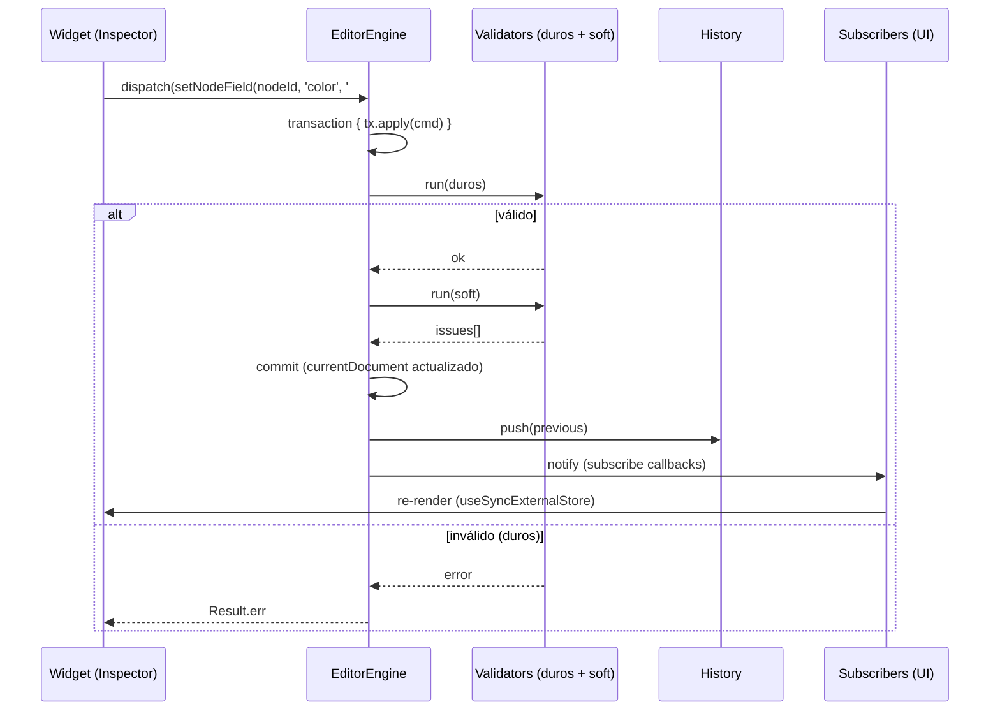

# 02 — Guía de arquitectura de Yggdrasil Forge

**Para colaboradores do código que queren entender como están organizadas as pezas antes de tocalas.** Asume que xa coñeces o editor desde a [Guía 01](./01-editor-user-guide.md).

---

## Principios reitores

Antes de mirar o código, estes son os tres principios que **decidiron a forma de todo**:

1. **Same Data. Different Themes.** O dato (un grafo de progresión) é **invariante**. O render, a UX e os efectos son **variantes**. Iso aplica tanto a temas visuais como a contextos de uso (educativo, gaming, certificacións).
2. **Domain Model: o Registry describe CONCEPTOS, non widgets.** O Property Registry di "este campo é un número entre 1 e 10". O Inspector React resolve un widget concreto (input number). Outra UI (Tauri, CLI, voz) podería resolver outro widget co mesmo Registry. **Cero acoplamento entre o domain e a presentación.**
3. **A boca non pode divirxir da conciencia.** O editor (boca) NUNCA debe ofrecer opcións que o runtime (conciencia) non saiba aplicar. Iso é o **gate manifesto-descriptor**, que verás repetido en varias capas.

---

## As cinco capas

```
┌─────────────────────────────────────────────────────────────┐
│                    Apps (consumers)                          │
│  examples/editor    examples/oberon-panadeiro    ...         │
└──────────┬─────────────────────┬─────────────────────────────┘
           │                     │
┌──────────▼─────────────────────▼─────────────────────────────┐
│              @yggdrasil-forge/editor-react                    │
│  React UI do editor: paneis, canvas, inspector, sub-editores  │
└────────────────────────┬──────────────────────────────────────┘
                         │
┌────────────────────────▼──────────────────────────────────────┐
│              @yggdrasil-forge/editor-core                     │
│  Headless: Engine, Command, Transaction, Selection, History,  │
│  Property Registry, Validators (duros + soft)                 │
└────────────┬──────────────────────────────────┬───────────────┘
             │                                  │
┌────────────▼──────────┐         ┌─────────────▼───────────────┐
│  @yggdrasil-forge/    │         │  @yggdrasil-forge/react     │
│  core                 │         │  Render do SkillTree con    │
│  Tipos do dominio,    │         │  SVG + viewport + temas     │
│  runtime, manifesto,  │         │                             │
│  validadores, layout  │         │                             │
└────────────┬──────────┘         └─────────────┬───────────────┘
             │                                  │
             ▼                                  ▼
       @yggdrasil-forge/common (tipos comúns: LocalizedString, ...)
```

### `@yggdrasil-forge/common`
Tipos transversais sin lóxica. O máis usado: `LocalizedString = string | Record<string, string>`.

### `@yggdrasil-forge/core`
**O dominio puro**. Tipos (`NodeDef`, `EdgeDef`, `TreeDef`, `Effect`, `UnlockRule`, `Resource`, …), runtime (UnlockResolver, EffectsRunner), validadores duros, motor de layout. **Cero React.** Pode usarse desde Node, CLI, Tauri, ou outro frontend.

**Pezas clave**:
- `TreeEngine`: o "estado vivo" dunha árbore. Aplica unlocks, executa effects, mantén `NodeState`.
- `supportManifest`: rexistro de que `Effect` types e `UnlockCondition` types o runtime aplica realmente. **A "conciencia" da máquina** (ver §gate-manifesto).
- `Layout`: algoritmos (`compute`, `radial`, …) que asignan `position` aos nodos.

### `@yggdrasil-forge/react`
**Render visual**. SkillTree SVG, viewport (pan/zoom), iconsets, temas. Consume un `TreeEngine` e píntao. **Non sabe nada do editor**. Pode usarse en Preview, Authoring (a través do canvas do editor) ou en apps non-editor.

### `@yggdrasil-forge/editor-core`
**O motor headless do editor**. Engade unha capa de **edición** sobre `@core`:
- `EditorEngine`: orquestra Commands, Transactions, History, Validation.
- `EditorDocument` = `{ tree: TreeDef, editor: EditorMeta }`.
- `Command` / `Transaction`: a unidade atómica de cambio.
- `History` (Immer snapshots): undo/redo.
- `SelectionEngine`: que nodos/arestas/grupos/regions están seleccionados.
- `Operation` / `Tool`: abstraccións para interaccións con preview (drag-move, marquee).
- **Validators duros** (structural, uniqueIds, referentialIntegrity) — bloquean commits inválidos.
- **Soft validators** (asymmetricExclusion, prerequisiteCycle, layoutOverflow, unsupportedFeature) — non bloquean, emiten warnings (`ValidationIssue`).
- **Property Registry** (descriptors do `NodeDef` editable).
- **Gate manifesto-descriptor** (`authorableEffectTypes()`).

**Cero React aquí tampouco.** Outra UI podería ler o mesmo Registry e renderizar a súa propia.

### `@yggdrasil-forge/editor-react`
**A UI React do editor**: paneis (Outliner, Inspector, Problems), Canvas (engloba o SkillTree + overlay de selección/ghost/marquee), widgets, sub-editores estruturados.

---

## O fluxo dunha edición — vista de paxaro



### Pasos detallados

1. **O usuario edita un widget** (ex. cambia a cor).
2. O widget chama `descriptor.set(nodeId, '#ff0000')` que devolve un `Command` (un obxecto serializable con `type` + `mutate(draft)`).
3. O `InspectorPanel` fai `editorEngine.dispatch(cmd)`.
4. `dispatch` abre unha **Transaction** internamente, aplica o command, e executa os validadores **duros**.
5. Se os duros pasan, executa os **soft** e gardo o resultado en `currentIssues`.
6. Substitúe `currentDocument` polo novo, fai `history.push(previous)`, e notifica a subscribers.
7. Todos os `useSyncExternalStore` re-renderizan: o canvas mostra a nova cor, o Inspector mostra o novo valor, o ProblemsPanel actualiza warnings.

---

## EditorDocument — a estrutura raíz

```ts
interface EditorDocument {
  readonly tree: TreeDef          // O dato canónico (definido en @core)
  readonly editor?: EditorMeta    // Metadata só do editor (NON serializada para runtime)
}
```

- **`tree`** é o que un consumidor non-editor (preview, runtime) carga. Contén nodos, arestas, recursos, layout config.
- **`editor`** contén metadata local: `coordinateBounds`, viewport persistido, futuro: notas do autor, posición de paneis, etc. Non afecta o runtime.

Cando o editor garda a árbore para Preview, **só serializa `tree`**. O `JsonDocumentAdapter` decide o formato.

---

## Command + Transaction — a unidade atómica de cambio

Todo cambio no documento pasa por aquí. **Non hai mutación directa de `currentDocument`**.

```ts
interface Command {
  type: string                            // ex. 'setNodeField', 'addNode', 'moveNode'
  label?: LocalizedString                 // para a entrada de history
  mutate(draft: EditorDocument): void     // executado dentro dun produce() de Immer
}
```

**Por que Immer?** Permite escribir mutacións aparentemente "imperativas" (`node.color = '#ff0000'`) pero produce un novo documento inmutable. Iso é a base do `useSyncExternalStore`: cada commit produce unha referencia nova → React detecta o cambio → re-render. Sin Immer, ou facemos copia manual (verboso) ou perdemos eficiencia.

### Transaction
Unha transacción pode conter **varios commands**. Iso é a clave para que **drag = 1 entrada de history**, mesmo se moven 5 nodos.

```ts
editorEngine.transaction({ en: 'Move' }, (tx) => {
  for (const cmd of moveCommands) {
    tx.apply(cmd)
  }
})
// Todos os commands aplícanse atomicamente:
// - Se algún duro falla → rollback completo (cero cambios).
// - Se todos pasan → 1 entrada de history.
```

---

## Selection — o que está seleccionado

```ts
type SelectionRef =
  | { kind: 'node'; id: string }
  | { kind: 'edge'; id: string }
  | { kind: 'group'; id: string }
  | { kind: 'region'; id: string }
```

`SelectionEngine` é un store reactivo:
- `current()` → array de refs.
- `subscribe(cb)` → notifica cambios.
- `replace([...])`, `add(ref)`, `toggle(ref)`, `clear()`.

> **⚠ Cicatriz histórica**: `current()` **devolve un array novo cada chamada**. Iso rompe `useSyncExternalStore` (que require referencias estables senon hai cambio). **Patrón**: cache local en `useRef`, refrescada SÓ no callback do subscribe. Vai a `useSelectedRefs` en `EditorCanvas.tsx` ou `InspectorPanel.tsx` para ver o patrón.

---

## Operation — preview + commit en bloque

Para interaccións con feedback en vivo (drag-to-move, marquee), Operations encapsulan o estado **provisional** sin tocar o documento ata o commit final.

```ts
interface Operation {
  update(point, modifiers): void
  preview(): OperationPreview      // { nodePositions?: Map<id, pos> }
  commit(): readonly Command[]     // Commands a aplicar nunha transacción
  cancel(): void
}
```

**MoveOperation** (a única implementada agora):
1. Ao iniciar drag: captura posicións iniciais dos seleccionados.
2. `update(currentDoc)` en cada pointermove: calcula offsets, actualiza `preview().nodePositions`.
3. **O Overlay React** debuxa os ghosts nas posicións de preview. **O documento non se tocou aínda.**
4. Ao soltar: `commit()` devolve `moveNode` commands → `engine.transaction()` → 1 entrada de history.
5. Se Escape: `cancel()` → cero efecto colateral.

> **★ Decisión arquitectural banked**: o `InteractionController` + `Tools` (`SelectTool`, `MoveTool`) de 7.3 quedan **latentes** ata que exista UI de barra de tools (v1.2). O editor v1 usa Operations directamente desde o canvas. Razón: o modelo Tool decide en cada `InputEvent` atómico; o caso real "drag vs click polo limiar" non encaixa.

---

## History — undo / redo

```
[doc₀]  →  edit  →  [doc₁]  →  edit  →  [doc₂]  ← currentDocument
   ↑                  ↑                  ↑
   └─ history[0]      └─ history[1]      
                                          (puntero ao "presente")
```

- Cada commit fai `history.push(previousDocument)`.
- `undo()` move o puntero atrás. `redo()` adiante.
- Inmutable: cada documento é unha snapshot de Immer compartida (estruturalmente; cero copia profunda).
- `maxHistory` limita a memoria (default 100).

---

## Property Registry — describir o editable

```ts
type PropertyType =
  | { kind: 'text' }
  | { kind: 'localizedText' }
  | { kind: 'number'; min?, max?, step? }
  | { kind: 'enum'; options: readonly string[] }
  | { kind: 'color' }
  | { kind: 'boolean' }
  | { kind: 'structured'; of: 'effects' | 'prerequisites' | 'exclusions' | 'cost' | 'tiers' | 'costPerTier' }

interface PropertyDescriptor<T = unknown> {
  key: string                    // campo en NodeDef (ex. 'color', 'label')
  label: LocalizedString         // como amosalo na UI
  type: PropertyType             // que widget precisa
  group: 'identity' | 'appearance' | 'logic'
  readonly?: boolean
  describe?: LocalizedString
  get(node: NodeDef): T | undefined
  set(nodeId: string, value: T): Command
}

export const nodePropertyRegistry: readonly PropertyDescriptor[] = [
  // id (readonly), type (enum), label (localizedText), description,
  // color, icon, shape (enum), size (number),
  // tier (number), maxTier (number),
  // cost (structured), costPerTier, tiers, effects, prerequisites, exclusions
]
```

**Por que este patrón?**
- O Inspector React itera o registry, agrupa por `group`, e renderiza widget polo `type.kind`. **Cero hardcode de campos no Inspector.**
- Engadir un campo novo é engadir unha entrada ao registry. O Inspector recoñéceo automaticamente.
- O `set` devolve un Command (non muta nada). A mutación é explícita e atómica.

### Type-test de non-drift
As opcións de enum (`NODE_TYPE_OPTIONS`, `NODE_SHAPE_OPTIONS`) son tuplas `as const` cun type-test:

```ts
type Equals<A, B> = ... // helper de igualdade exacta
const _check: Equals<(typeof NODE_TYPE_OPTIONS)[number], NodeType> = true
```

Se `@core` engade un valor a `NodeType` sin actualizar a tupla → typecheck falla. **Cero drift silencioso.**

---

## Validators — duros vs brandos

### Duros (sempre, automáticos no engine)
Bloquean transaccións inválidas. **`dispatch` devolve `Result.err`**, o documento non cambia.

- `structuralValidator`: o documento ten a estrutura mínima (tree + nodes + …).
- `uniqueIdsValidator`: non hai ids duplicados.
- `referentialIntegrityValidator`: edges/prerequisites/exclusions referencian nodos existentes.

### Soft (opcionais, rexistrar con `createDefaultValidators()`)
Non bloquean. Emiten `ValidationIssue` que o engine almacena en `currentIssues`. **O ProblemsPanel renderízaos.**

- `asymmetricExclusionValidator`: A→B sin B→A.
- `prerequisiteCycleValidator`: ciclo en prerequisites.
- `layoutOverflowValidator`: nodos fóra dos bounds.
- `unsupportedFeatureValidator`: a árbore usa un Effect type `modify_stat` ou `plugin`.

### ⚠ Como rexistralos
```ts
const engine = new EditorEngine(doc, {
  validators: createDefaultValidators(),  // ← os soft. Os duros van automáticos.
})
```

Sin pasar `validators`, o `ProblemsPanel` quedará sempre baleiro. **Iso pasou no `examples/editor` ata 7.5c-ii fase 1**, onde se descubriu durante o test do loop conciencia-voz.

---

## ★ supportManifest — a conciencia da máquina

`supportManifest` é un rexistro que **`@core` exporta** sobre que features o runtime soporta realmente. Vive en `packages/core/src/engine/supportManifest.ts`.

```ts
export const SUPPORTED_EFFECT_TYPES = [
  'modify_resource', 'modify_node_state', 'set_node_visibility',
  'unlock_node', 'set_progress', 'trigger_event',
  'conditional', 'composite',
] as const

export const UNSUPPORTED_EFFECT_TYPES = ['modify_stat', 'plugin'] as const

// Type-test exhaustivo:
type _check = Equals<Effect['type'], (typeof SUPPORTED_EFFECT_TYPES)[number] | (typeof UNSUPPORTED_EFFECT_TYPES)[number]>
// Se @core engade un Effect kind sin clasificalo → typecheck falla.
```

### Por que existe?
A unión `Effect` declarase no schema do dominio (a forma do dato). **Pero non todos os tipos están aplicados polo runtime** — algúns son placeholders para futuro (`modify_stat`) ou para integración externa (`plugin`).

Iso crea un risco: o editor podería deixarche autorizar un `modify_stat`, gardarse no JSON, e cando o runtime o intentase aplicar... **nada pasa**. Bug silencioso.

**Solución**: o manifesto. Tres mecanismos en concerto:
1. As tuplas `SUPPORTED` / `UNSUPPORTED` (datos).
2. O type-test (compile-time: garante cobertura completa).
3. **O EffectsRunner consulta o manifesto para saber se aplicar** (`if (UNSUPPORTED.includes(effect.type)) return skipResult()`).

---

## ★ Gate manifesto ↔ descriptor — a boca non diverxe da conciencia

O `@editor-core` exporta:

```ts
import { SUPPORTED_EFFECT_TYPES } from '@yggdrasil-forge/core'

export function authorableEffectTypes(): readonly string[] {
  return SUPPORTED_EFFECT_TYPES
}

export function authorablePlainEffectTypes(): readonly string[] {
  return SUPPORTED_EFFECT_TYPES.filter(t => t !== 'composite' && t !== 'conditional')
}
```

O `EffectsEditor` (sub-editor React) usa **`authorablePlainEffectTypes()`** para alimentar o `<select>` "Engadir effect". **O Inspector NUNCA pode propoñer `modify_stat` nin `plugin`** — son UNSUPPORTED.

### O test do gate (paga a pena lelo)

```ts
it('★ Gate manifesto-descriptor: coincide co SUPPORTED do manifesto', () => {
  const authorable = new Set(authorableEffectTypes())
  const supported = new Set(SUPPORTED_EFFECT_TYPES)
  expect(authorable).toEqual(supported)
})

it('EXCLÚE modify_stat e plugin (UNSUPPORTED)', () => {
  expect(authorableEffectTypes()).not.toContain('modify_stat')
  expect(authorableEffectTypes()).not.toContain('plugin')
})
```

Iso garante que a **boca** (Inspector) **non pode divirxir** da **conciencia** (motor):
- Se `@core` engade un Effect kind como SUPPORTED → aparece automáticamente no selector (cero cambios).
- Se o engade como UNSUPPORTED → segue excluído.
- Se non o clasifica → o type-test do manifesto falla en compile.

O mesmo patrón aplicará a UnlockCondition na fase 2 de 7.5c-ii.

---

## ★ Loop conciencia ↔ voz

```mermaid
graph LR
    A[Usuario edita campo<br/>ex.: foo.exclusions = bar] --> B[setNodeField Command]
    B --> C[EditorEngine dispatch]
    C --> D[Transaction + commit]
    D --> E[Soft validators run]
    E -->|asymmetricExclusion detecta<br/>bar non ten foo| F[ValidationIssue creado]
    F --> G[engine.currentIssues actualizado]
    G --> H[engine.subscribe notify]
    H --> I[ProblemsPanel re-renderiza<br/>useSyncExternalStore]
    I --> J[Usuario clica warning]
    J --> K[selection.replace nodeId]
    K --> L[InspectorPanel + Canvas<br/>enfocan o nodo]
    L --> M[Usuario arranxa]
```



**Iso é o que define o editor como "consciente"**. Edita algo dubidoso → o sistema detecta → ti enterates → arranxas. O bucle pecha desde o dato → motor → UI → usuario → dato.

O test ★ que cubre o circuíto completo está en `packages/editor-react/__tests__/StructuredEditors.test.tsx`.

---

## Renderización en tempo real — `useSyncExternalStore`

```ts
const doc = useSyncExternalStore(
  (cb) => editorEngine.subscribe(cb),
  () => editorEngine.getDocument(),
)
```

Cada commit do engine notifica subscribers. Cada subscriber re-renderiza. Iso é como o Inspector, o Canvas e o ProblemsPanel **están sempre sincronizados** sen prop drilling nin Redux.

### ⚠ Cicatriz: cache estable
`SelectionEngine.current()` devolve **array novo cada chamada**. Iso fai que `useSyncExternalStore` entre en bucle (`Maximum update depth exceeded`). **Patrón**:

```ts
const cacheRef = useRef<readonly SelectionRef[]>([])
const subscribe = useCallback((cb) => {
  const unsub = selection.subscribe(() => {
    cacheRef.current = selection.current()
    cb()
  })
  cacheRef.current = selection.current()
  return unsub
}, [selection])
const getSnapshot = useCallback(() => cacheRef.current, [])
return useSyncExternalStore(subscribe, getSnapshot, getSnapshot)
```

A cache só refresca cando o subscribe dispara. Entre disparos devolve a mesma ref → `useSyncExternalStore` está feliz.

---

## Cicatrices históricas (★ paga a pena coñecelas)

Estas son situacións nas que un bug se detectou só por revisión visual (non por tests automatizados):

### A.6.30 — Exclusións asimétricas (reverse-index)
**Problema**: exclusións `A→B` necesitaban que `B→A` se aplicase tamén en runtime, pero o índice só miraba o "lado A". Iso rompía o gameplay.
**Solución**: reverse-index construído na inicialización do `TreeEngine`. `getEffectiveExclusions(nodeId)` devolve tanto as declaradas como as inferidas. **Ver `TreeEngine.ts`.**

### A.6.39/40 — CTM do `<g>` interno (overlay desaliñado)
**Problema**: o overlay React (aneis, ghosts) collía `getScreenCTM()` do `<svg>` raíz. Pero o transform pan/zoom do SkillTree está nun `<g>` interno. Resultado: overlay desaliñado co render ao facer zoom.
**Solución**: `findCanvasCtmElement` busca o primeiro `<g>` descendente do `<svg>`. O `getCtmScale` permite que aneis e ghosts **escalen co zoom**.
**Banco prioritario**: expoñer `screenToWorld`/`worldToScreen` no `SkillTreeHandle` para eliminar o coñecemento estrutural.

### Bucle `useSyncExternalStore` con `selection.current()`
Documentado arriba en §"Cicatriz: cache estable".

---

## Estrutura do monorepo

```
yggdrasil-forge/
├── packages/
│   ├── common/                 # tipos comúns
│   ├── core/                   # dominio + runtime
│   │   ├── src/types/          # NodeDef, EdgeDef, Effect, Cost, ...
│   │   ├── src/engine/         # TreeEngine, EffectsRunner, supportManifest
│   │   └── src/layout/         # algoritmos de layout
│   ├── react/                  # SkillTree SVG + viewport
│   ├── editor-core/            # headless do editor
│   │   ├── src/EditorEngine.ts
│   │   ├── src/command/        # Command, Transaction, History
│   │   ├── src/selection/      # SelectionEngine
│   │   ├── src/operation/      # MoveOperation, Operation interface
│   │   ├── src/validation/     # duros + soft + createDefaultValidators
│   │   └── src/property/       # PropertyDescriptor, nodePropertyRegistry, authorableEffectTypes
│   └── editor-react/           # UI React
│       └── src/
│           ├── EditorShell.tsx
│           ├── canvas/         # EditorCanvas + CanvasOverlay
│           ├── inspector/      # InspectorPanel + widgets + structured/
│           ├── panels/         # OutlinerPanel + ProblemsPanel
│           └── shell/          # TopBar + StatusBar
├── examples/
│   ├── editor/                 # a app runnable do editor
│   └── oberon-panadeiro/       # demo de @react sin editor
├── docs/
│   ├── architecture/MASTER.md  # o documento canónico
│   └── guides/                 # estás aquí
└── tools/
    └── icon-preview/           # ferramenta para previsualizar iconos
```

---

## Decisións banked (prioridade alta)

Estes son problemas/melloras coñecidas que NON están bloqueando nada agora pero que vale a pena abordar antes de que se acumulen:

1. **★ `screenToWorld`/`worldToScreen` no `SkillTreeHandle`** (`@react`). Eliminaría a necesidade do editor de coñecer a estrutura DOM interna do SkillTree. Está banked desde a cicatriz A.6.39/40.
2. **`createSoftValidators` rename** (de `createDefaultValidators`). O nome actual é enganoso porque os "duros" tamén son default — só os soft precisan rexistro.
3. **`VERSION` sync entre `@core/index.ts` e `@core/package.json`** — o barrel exporta `'0.0.0'` mentres o package está en `0.4.0`.
4. **Pantalla de bienvida / Open example / Import** — agora a app carga panadeiro hardcoded.
5. **Locale do canvas** — non hai forma de cambiar a locale activa. O editor de LocalizedString edita `en` por defecto.
6. **Tools/InteractionController de 7.3 latentes** ata UI de barra de tools.
7. **dockview-react v7** quando estabilice.

---

## Que vén despois — fases pendentes

| Fase | Descripción |
|---|---|
| **7.5c-ii fase 2** | `prerequisites` editable (UnlockRule aniñada: all/any/condition). Effects `composite`/`conditional` editables. Mesmo gate aplicado a UnlockCondition. |
| **7.5d** | Tools de creación (engadir nodo/aresta novo). Aquí entrarán InteractionController + Tools de 7.3. |
| **7.5e** | Edición común multi-selección. Edición de GroupDef e Region. |
| **7.6** | Pantalla de bienvida, Open example, Import/Export, multi-doc. |
| **8.x** | Plugins de @react (themes), exporters (JSON/XML/SQL), preview interactivo avanzado. |

Para **engadir capacidades** ti mesmo, le a [Guía de extensión](./03-extension-guide.md).
Para **usar o editor**, le a [Guía 01](./01-editor-user-guide.md).
